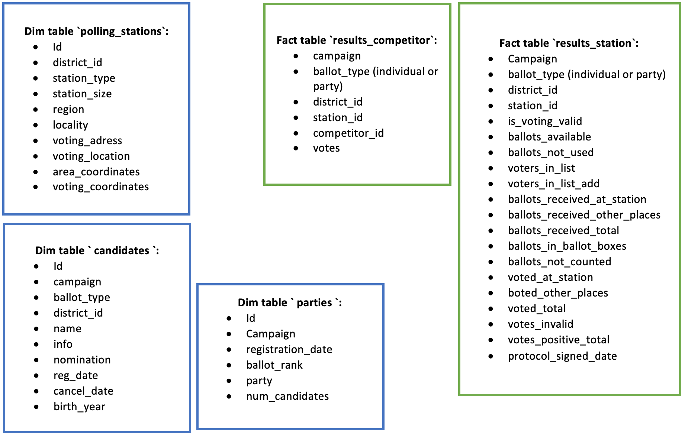
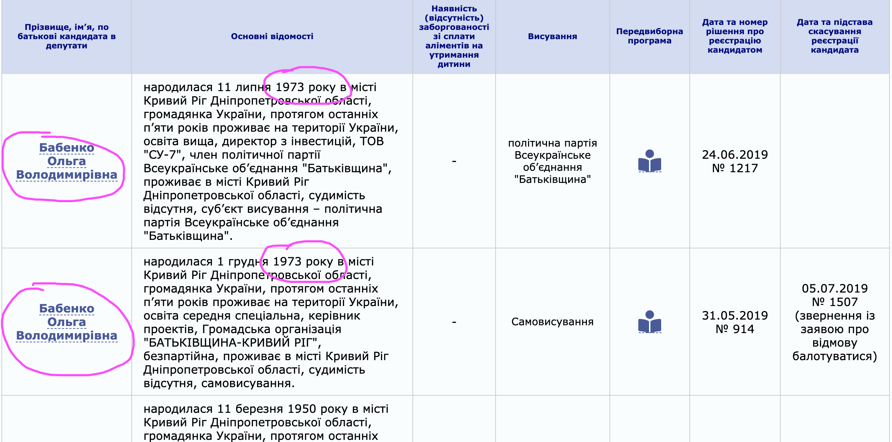

# Ukrainian Elections Database

## Motivation
The results of Parliamentary and Presidential elections in Ukraine
are published online by the [Central Electoral Commission (CEC)](https://cvk.gov.ua/index.html).
The results are good enough to answer the most important questions during the election:
who are the *winners* of the *current* election. It is also possible to check the results aggregated
by region or even for a single polling station. But data presented in such a form makes complicated
other analyses. Some examples of questions that could be analyzed with electoral data include:
* How preferences of citizens in a particular locality changed between elections?
* How citizen from small towns/cities/villages voted?
* How the support for a repeated candidate or party changed from one election to another
in a particular locality?
* Do the results from the polling stations adhere to some statistical distribution
(if no, the results are likely to be manipulated).

To visualize the results on maps, it is also very useful to have geospatial information attached to the data.

Those questions might be important in some settings, but answering them requires a costly preparatory step of
downloading the data in a useful form. In other words, some data engineering can make the data from CEC website
much more useful.

The current goal of this project is to create a database of electoral results that would allow
to visualize the data easily and answer questions similar to the ones mentioned above.

The current version of the code creates a database with the results of three Parliamentary
elections campaigns of 2014, 2014 and 2019. Other elections campaigns can be added by
customizing the respective DAGs.

## Information about Parliamentary elections in Ukraine

The current electoral system in Ukraine specifies that half of the seats is distributed
among parties in the national ballot. So, there is an all-Ukraine voting for the parties.
Parties who get the result above the minimum threshold get there share of seats.

Another half of the seats is filled by the persons
who win a separate election in their election districts. There are 225 election districts. They represent
dense geographic area with approximately equal number of citizen. A candidate in such an election may
or may not represent a party.

Normally, these two elections are held together. So that a voter receives two ballots: one with a list
of parties and the other with the list of candidates.

## Data overview and data modelling

#### Data sources

##### Election results for individual polling stations

It is the lowest aggregation level possible. It is available for
Parliamentary and Presidential elections from [CEC website](https://cvk.gov.ua/index.html).
The results are posted in the form:

| Polling station | Voters in List | Total Votes | ...| Competitor1 | Competitor2 | .... |
------------------|----------------|-------------|----|-------------|-------------|------|
| station1       |   1234          |    567      |    |     12      |    34       |      |
| station2       |   1345          |    789      |    |     78      |    89       |      |

There are three parts in this table. Let's start from right to the left:
1) Number of votes for a particular competitor (person or party for Parliamentary elections,
person for Presidential elections).

    Wide representation allows compact placement of the data
on screen, but wide form would create unnecessary complications for the database. That is
why this data will be stored in the long form in the database (table `results_competitor`).

2) General numbers for the polling station like total number of votes.

    This data is neccessary to measure the percentage of votes for a competitor and other
    relative metrics. Normally there are 15-30 competitors in the ballot, so there is
    a big overhead cost to storing this info for each competitor record in the long format.
    That is why such a general information will be stored in a separate table `results_station`.

3) Explicit dimensions (polling station id) and implicit dimensions (campaign id, voting district).

    These dimensions should be attached to both tables `results_competitor` and
    `results_station` to allow a mutual join between them and joins with other tables.

##### Information about polling stations

Includes station type and size, address with postal code,
covered residential area description and geospatial (GeoJSON) information.

This information is available as a
list of actual polling stations from
the [State Voters Register (SVR)](https://www.drv.gov.ua) and the stations actual at the time of
a particular election campaign from (CEC)[https://cvk.gov.ua/index.html]. We will use SVR data
because it is easy to download with API as a JSON file and has GeoJSON
geographical information. But a few
polling stations might be missing from this list, so the data can be enriched with the info from
CEC.

##### Information about competitors: persons and parties

It is simple in case of parties
because there are a few dozen of them. However, there were dozens thousands people who competed
for a MP seat. CEC provide a candidate text description from which such information as party
membership, economic activity, gender etc can be inferred. In theory, this
information can be further enriched from other sources.

#### Database schema
A normalized star schema for the final tables is shown below. The fact table consists of two parts:

* general station-level results `results_station` with such information as the total number of votes
at the polling station;
* `results_competitor` with the number of votes for a particular competitor as the polling station.

Dimension tables:
* `polling_stations` with type and size, location and geospatial information about polling stations.
It allows to attach geographical information to the election outcomes from the fact tables.
* `campaign_candidates` includes information about a candidate *in the election campaign*. A person
might have participated in a few different campaign in the past and had represented the same
or different political parties. There will be a few entries in the table for such a person.
* `campaign_parties` with information about parties. If a party participated in a few
campaign a similar logic to the previous table.

Information about polling stations is *static* in a sense that does not normally change from one
election campaign to another. Information for an election campaign is *dynamic* in a sense
it describes only that elections and should not be affected by the other election campaign.
That is why the general steps to fill the database will be:

* process and upload the station data;
* process and upload election data for campaign A
* process and upload election data for campaign B
* process and upload election data for campaign ...

Each of the steps listed above can have individual ETL. For example, after some future election campaign
we can run ETL and upload only the results for that campaign. However, the first step of uploading
the stations data should be done in the beginning for practical purposes of using the data. Without
the station data the usefulness of the campaign data will be limited (for example, it will not
be possible to visualize the data on maps).

#### ETL

##### Election results from [CEC website](https://cvk.gov.ua/index.html)
* DAG: Parse and upload to S3
    - Parse data on the website and save locally
    - Run data checks
    - Upload to S3
* DAG: Transform and load to Redshift
    - Upload from S3 to staging_tables
    - Transform and load in the production table
    - Run data checks

##### Polling stations data from [(SVR) website](https://www.drv.gov.ua)
* DAG: Parse and upload to S3
    - Load data through SOAP protocol and save locally.
    - Upload to S3
* DAG: Transform and load to Redshift
    - Upload from S3 to staging_tables
    - Transform and load into the production table
    - Run data checks

DAG are run by Apache Airflow. Data parsing from websites is done with separate dags because
it is the most extensive process that requires much time and might be prone to errors and it does
not require communication with the database. Such a separation makes ETL more robust.

#### Infrastructure
I chose Amazon Redshift to process and store the final data because it allows
easy processing of the information. For example, it will be able to extract
valuable information from extensive descriptions of candidates bio or descriptions
of areas where the voting stations are located. However, the main goal of this project
(to make the data easily accessible in one place) may be also reached with the help
of simpler database solutions like PostgreSQL.

I used a cluster with 4 dc2.large nodes.

#### Data dictionaries
Data dictionary can be found [here](data_dictionary/data_dictionary.xlsx).

## Data transformation in Redshift
Before uploading to production tables, the data was cleaned and enriched:

    * A few records in the polling station data were fixed.
    * Attribution of polling station to region and locality is calculated.
    * Numbers are properly converted from text to integer types whenever possible.
    * There are a few cases when people with the same name compete in the same election
    in the same polling district. (There is a belief that such duplicate candidates
    might drive votes away from a popular candidate, so there is some incentive to
    register such technical candidates against competitors). For such candidates both name
    and birth year is present in the results page. So processing of such
    candidates was done by comparing their birthday years with the info stated in their bio.

## Data exploration

#### Data quality checks
A few checks were run within DAGs. They can be grouped into two broad categories:

    * Number of rows >0.
    * There are no rows of particular type in the table (for example, duplicate records).

All the checks passed except one on duplicate candidate records. It turns out that
[there were two candidates](https://www.cvk.gov.ua/pls/vnd2019/wp033pt001f01=919pf7331=33.html)
with the same name and birth year in the same polling district
(see screenshot below). Since in this case one of the candidates eventually decided
not to participate in the elections, there was no actual confusion in the
connecting numbers from different tables.

#### The final tables
There are more than 7m records in the database.

|  table                 |    rows   |
|------------------------|-----------|
| parties                |        77 |
|  candidates_individual |     9,906 |
|  polling_stations      |    33,464 |
| results_station        |   186,308 |
| results_competitor     | 6,972,577 |

With its help it is easy to answer such questions as:
*Was it beneficial for a candidate to be at the top of candidates list?*
Let's compare the average share of votes per rank in the ballot in this year elections.

|  rank in the ballot    |  % votes  |
|------------------------|-----------|
| 1                      |      8.3% |
| 2                      |      8.2% |
| 3                      |      7.5% |
| 4                      |      7.9% |
| 5                      |      7.9% |

So, the first and second candidates in the list got more votes. It is still to be checked whether this
results is statistically significant.

## How this problem would be approached differently if

**If the data is increased by 100x**. In other words, instead of 3 election campaign we need to
upload 300.

It will be necessary to increase the size of the cluster, let's say by ~10x. It is not 100x because
currently the cluster does not operate at full potential.

The main bottleneck would be parsing data from website. This task is slow and we have only 1 website,
so there is a limit to the downloading speed. So, data download time will increase by 100x.

Upload to Redshift can be parallelized, so there will be only small increase in the processing time.

The code is scalable. If the data structure remains the same, new DAGs can be added easily and quickly.

**If the pipelines were run on a daily basis by 7am.** We just need to set up a daily update interval.
Airflow support such regular updates.

**If the database needed to be accessed by 100+ people.** It means that processing power of the cluster
should be increased and optimized for high CPU usage.

## How to run the code

1. Clone the repository.
2. Run `export AIRFLOW_HOME=/path/to/airflow/folder/in/this/repository`
3. Create virtualenv with Python 3.6 and run `pip install -r requirements.txt`
4. Run `airflow initdb` command.
5. Create AWS user, S3 bucket and Redshift cluster.

    The user should have full access to the S3 bucket.

    It advisable to create S3 bucket and redshift cluster in the same region to avoid
    costs for data transfer between regions.

    I used a cluster with 4 dc2.large nodes, but 2 nodes should be enough.

    Cluster might be created after the data is loaded from the web to S3.

    Fill the bucket name and local folder name into airflow/config/config file.

6.  Run [airflow webserver and airflow scheduler](https://airflow.apache.org/start.html).
Access Airflow webserver. You should see the dags created in this project.

8. Create connection to AWS:
    * **Conn Id:** Enter `aws_credentials`.
    * **Conn Type:** Enter `Amazon Web Services`.
    * **Login:** Enter your **Access key ID** from the IAM User credentials.
    * **Password:** Enter your **Secret access key** from the IAM User credentials.

    Create connection to Redshift:
    * **Conn Id:** Enter `redshift`.
    * **Conn Type:** Enter `Postgres`.
    * **Host:** Enter the endpoint of your Redshift cluster, excluding the port at the end.
    You can find this by selecting your cluster in the Clusters page of the Amazon Redshift
    console. IMPORTANT: Make sure to NOT include the port at the end of the Redshift endpoint
    string.
    * **Schema:** Schema of the Redshift cluster.
    * **Login:** Username at the Redshift cluster.
    * **Password:** Enter the password you created when launching your Redshift cluster.
    * **Port:** Enter `5439`.

7. Activate DAGs. They need to be activated sequentially.
    * First, run dags that start with `1`.
    * Upon completion, run DAG `2.redshift.upload_polling_stations`
    * Upon completion run one-by-one DAGs starting with `3`. They will upload the
    data from a particular election campaign into staging and then production tables. Since
    the staging tables are the same, it is absolutely necessary to have only 1 running DAG
    at this step.

8. Use the data from production tables.
